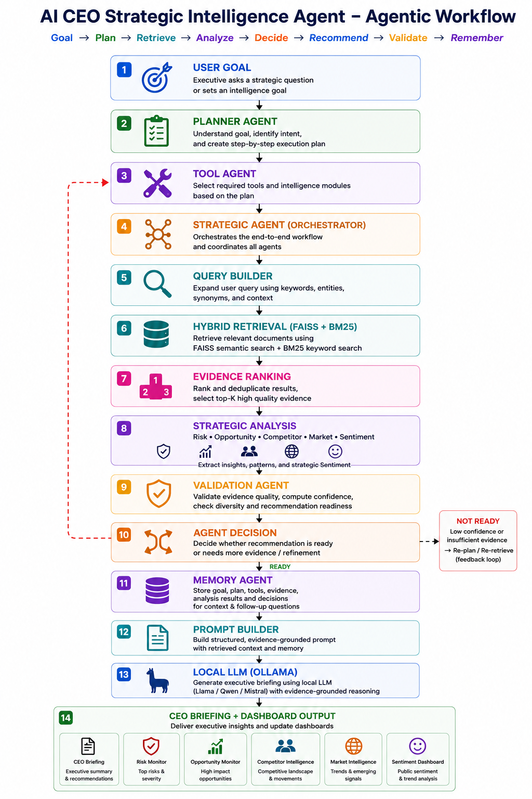

# 🧠 Microsoft Intelligent System

### AI CEO Strategic Intelligence Agent

An AI-powered Strategic Intelligence Platform that combines Retrieval-Augmented Generation (RAG), Hybrid Search (FAISS + BM25), Sentiment Analysis, Competitor Intelligence, Opportunity Monitoring, Risk Monitoring, AI Agent Workflow, and Executive Decision Support to generate evidence-based recommendations for leadership teams.

---

## 📌 Project Overview

Organizations generate massive amounts of information through news articles, technology blogs, competitor announcements, market reports, security reports, and product releases.

Manually analyzing this information is time-consuming and often results in missed opportunities and risks.

The Microsoft Intelligent System automatically collects, processes, analyzes, validates, and transforms unstructured business intelligence into executive-level insights using NLP, Information Retrieval, AI Agents, and Large Language Models.

Unlike a simple RAG system, this project demonstrates explicit AI Agent behaviour:

```text
Goal → Plan → Retrieve → Analyze → Decide → Recommend → Validate
```

The system acts as an AI-powered CEO advisor capable of:

* Monitoring Microsoft and competitor activity
* Detecting strategic opportunities and risks
* Performing sentiment and topic analysis
* Retrieving relevant evidence using Hybrid Search
* Planning before execution
* Selecting tools autonomously
* Validating recommendations before presentation
* Using memory for follow-up questions
* Generating CEO-level strategic briefings
* Producing actionable business recommendations

---

# 🎯 Objectives

* Build a complete NLP pipeline for strategic intelligence
* Implement Retrieval-Augmented Generation (RAG)
* Use Hybrid Search (FAISS + BM25)
* Analyze sentiment and strategic signals
* Compare Microsoft against competitors
* Implement explicit AI Agent capabilities
* Demonstrate planning before execution
* Demonstrate autonomous tool selection
* Analyze risks, opportunities, competitors, and market signals
* Validate recommendations before presenting them
* Store memory for follow-up questions
* Generate evidence-based executive recommendations
* Visualize intelligence through an interactive dashboard

---

# 🏗️ System Architecture


---

# 🔄 Data Flow Diagram



---

# 🤖 Agentic Workflow

The CEO Briefing workflow is not only:

```text
User → Prompt → LLM → Response
```

Instead, the system follows an agentic workflow:

```text
User Goal
        │
        ▼
Planner Agent
        │
        ▼
Tool Agent
        │
        ▼
Dynamic Query Expansion
        │
        ▼
Hybrid Retrieval
(FAISS + BM25)
        │
        ▼
Strategic Analysis
(Risk • Opportunity • Competitor • Market)
        │
        ▼
Validation Agent
        │
        ▼
Agent Decision
        │
        ▼
Memory Agent
        │
        ▼
Prompt Builder
        │
        ▼
Local LLM via Ollama
        │
        ▼
CEO Briefing
```

---

# 🧩 Agent Components

## Planner Agent

Creates an execution plan based on the user’s strategic question.

Example:

```text
Goal:
How should Microsoft compete with AWS and Google Cloud?

Plan:
- Analyze competitor activity and positioning
- Retrieve relevant evidence using hybrid retrieval
- Analyze risks, opportunities, competitors, and market signals
- Generate evidence-based CEO recommendation
- Validate recommendation before presenting final output
```

---

## Tool Agent

Selects the tools needed for the task.

Possible tools:

* Hybrid Retrieval
* Risk Analysis
* Opportunity Analysis
* Competitor Intelligence
* Market Intelligence
* LLM Generation

The selected tools depend on the user question.

---

## Strategic Agent

The Strategic Agent orchestrates the workflow.

It performs:

* Planning
* Tool selection
* Dynamic query expansion
* Evidence retrieval
* Strategic analysis
* Validation
* Decision creation
* Memory update

---

## Validation Agent

Checks whether the recommendation is ready for presentation.

It evaluates:

* Evidence count
* Source diversity
* Company diversity
* Confidence score
* Validation warnings
* Recommendation readiness

---

## Memory Agent

Stores recent interaction context during the session.

It stores:

* User goal
* Selected tools
* Validation result
* Evidence used
* Generated answer summary

This supports follow-up questions in the CEO Briefing page.

---

# 🚀 Key Features

## 1. Competitor Intelligence

Tracks strategic activity from:

* Microsoft
* AWS
* Google Cloud
* OpenAI
* NVIDIA

Provides comparative intelligence and competitor monitoring.

---

## 2. Hybrid Retrieval (FAISS + BM25)

Combines semantic search and keyword search.

### Semantic Search

* Sentence Transformers
* FAISS Vector Database

### Keyword Search

* BM25 Ranking

Benefits:

* Better recall
* Better precision
* Improved retrieval diversity
* Stronger evidence quality

---

## 3. Strategic Signal Detection

Documents are classified into:

* Opportunity
* Risk
* Neutral
* Irrelevant

Used for executive-level decision support.

---

## 4. Sentiment Analysis

Analyzes:

* Positive sentiment
* Negative sentiment
* Neutral sentiment

Provides market perception and business sentiment insights.

---

## 5. CEO Strategic Briefing

Supports questions such as:

* What AI strategy should Microsoft prioritize?
* How should Microsoft compete with AWS and Google Cloud?
* What are Microsoft's biggest cybersecurity risks?
* What strategic opportunities should Microsoft pursue?

The system retrieves relevant evidence, validates the recommendation, and generates executive recommendations.

---

# Retrieval Evaluation

The system uses a Hybrid Retrieval approach combining FAISS Semantic Search and BM25 Keyword Search.

## Why Hybrid Retrieval?

FAISS retrieves documents based on semantic meaning and contextual similarity, while BM25 retrieves documents using exact keyword matching.

In strategic intelligence systems, both capabilities are important:

* Semantic retrieval helps identify related business developments even when different wording is used.
* Keyword retrieval ensures that exact company names, technologies, products, and competitors are not missed.
* Hybrid retrieval combines both approaches to improve evidence quality for executive decision-making.

## Retrieval Comparison

| Query | FAISS Retrieval | BM25 Retrieval | Hybrid Retrieval |
|---------|---------|---------|---------|
| Microsoft AI investments | Retrieved semantically related AI investment articles | Retrieved exact Microsoft investment announcements | Combined both relevant context and exact evidence |
| Azure cloud competition | Retrieved cloud market trends and related competitors | Retrieved articles containing Azure and competitor names | Produced the most complete competitive analysis |
| NVIDIA partnership announcements | Retrieved semiconductor and AI partnership content | Retrieved exact NVIDIA partnership news | Improved evidence coverage |
| OpenAI enterprise adoption | Retrieved enterprise AI adoption discussions | Retrieved exact OpenAI references | Generated stronger business intelligence context |

## Observations

* FAISS performs well when similar concepts are expressed using different wording.
* BM25 performs well when exact terms such as company names, products, regulations, or technologies are present.
* Hybrid Retrieval consistently produced better evidence because it combines semantic understanding with keyword precision.

## Conclusion

The Hybrid Retrieval architecture was selected because executive intelligence tasks require both semantic reasoning and exact fact retrieval. Combining FAISS and BM25 improves retrieval accuracy, evidence diversity, and recommendation quality.

---

# 🛠️ Technologies Used

| Category | Technologies |
|-----------|-------------|
| Programming Language | Python |
| NLP | Sentence Transformers, Transformers |
| Retrieval | FAISS, BM25 |
| RAG | Hybrid Retrieval + Context Builder |
| AI Agents | Planner Agent, Tool Agent, Strategic Agent, Validation Agent, Memory Agent |
| LLM | Ollama |
| Data Processing | Pandas, NumPy |
| Dashboard | Streamlit |
| Data Collection | RSS Feeds, Technology Blogs |
| Storage | JSON Files |
| Visualization | Streamlit Charts |

---

# ⚙️ Design Decisions

## Why Hybrid Retrieval?

The system combines FAISS semantic retrieval with BM25 keyword retrieval.

Reasons:

* FAISS captures semantic similarity between documents and queries.
* BM25 captures exact keywords and company names.
* Combining both improves retrieval accuracy and evidence diversity.
* Better evidence leads to higher-quality strategic recommendations.

---

## Why Character-Based Chunking?

The project uses overlapping character-based chunking.

Reasons:

* Produces consistent chunk sizes for embeddings.
* Preserves context using overlap.
* Improves retrieval recall.
* Works effectively with FAISS vector search.

Although some evidence previews may begin mid-sentence, retrieval quality and LLM reasoning remain unaffected.

---

## Why Local LLM (Ollama)?

The system uses Ollama to run Large Language Models locally.

Benefits:

* No API costs
* Better privacy
* Offline execution
* Easier academic demonstration

---

## Why Streamlit?

Streamlit provides a lightweight framework for building interactive dashboards.

Benefits:

* Rapid development
* Easy visualization of intelligence outputs
* Supports interactive executive decision-making workflows

---

# 📂 Project Structure

```text
Microsoft-Intelligent-System/
│
├── agents/
│   ├── planner_agent.py
│   ├── tool_agent.py
│   ├── strategic_agent.py
│   ├── validation_agent.py
│   └── memory_agent.py
│
├── collectors/
├── preprocessing/
├── embeddings/
├── vectorstore/
├── retrieval/
├── sentiment/
├── intelligence/
├── dashboard/
├── utils/
├── data/
│
├── app.py
├── main.py
├── requirements.txt
└── README.md
```

---

# 🤖 AI Pipeline

The project follows a complete NLP, Retrieval-Augmented Generation, and AI Agent pipeline:

```text
Document Collection
(RSS feeds, blogs, news, competitor sources)
        │
        ▼
Data Cleaning & Deduplication
(Remove HTML, normalize text, remove duplicates)
        │
        ▼
Chunking & Metadata Enrichment
(Create overlapping chunks and add source information)
        │
        ▼
Embedding Generation
(Sentence Transformers)
        │
        ▼
Index Construction
(FAISS Vector Index + BM25 Keyword Index)
        │
        ▼
Hybrid Retrieval
(Combine semantic and keyword search results)
        │
        ▼
Planner Agent
(Creates execution plan)
        │
        ▼
Tool Agent
(Selects retrieval and analysis tools)
        │
        ▼
Strategic Analysis
(Risk, Opportunity, Competitor, Market)
        │
        ▼
Validation Agent
(Checks confidence and readiness)
        │
        ▼
Memory Agent
(Stores session interaction)
        │
        ▼
Prompt Builder
(Prepares grounded prompt)
        │
        ▼
Local LLM via Ollama
(Generates strategic briefing)
        │
        ▼
CEO Briefing Generation
(Risks, Opportunities, Recommendations)
        │
        ▼
Dashboard Visualization
(Streamlit Dashboard with executive insights)
```

---

# ▶️ Installation

Clone the repository:

```bash
git clone https://github.com/janvimahapadi-hub/Microsoft-Intelligent-System.git
cd Microsoft-Intelligent-System
```

Create virtual environment:

```bash
python -m venv venv
```

Activate environment:

```bash
venv\Scripts\activate
```

Install dependencies:

```bash
pip install -r requirements.txt
```

---

# ▶️ Run Application

```bash
streamlit run app.py
```

---

# 🧪 Example Strategic Questions

* How should Microsoft compete with AWS and Google Cloud in AI infrastructure?
* What are Microsoft's top strategic opportunities?
* Which competitor poses the biggest threat?
* How should Microsoft monetize AI agents?
* What risks could slow enterprise AI adoption?
* What cloud opportunities should Microsoft prioritize?
* Which AI investments will generate the highest enterprise value?

---

# 📈 Future Improvements

* Persistent memory using SQLite
* Real-time news monitoring
* Automated weekly intelligence reports
* Multi-company benchmarking
* Advanced topic modeling
* LangChain integration
* LangGraph workflow orchestration
* Forecasting and trend prediction
* PDF export for CEO reports

---

# 🎓 Academic Relevance

This project demonstrates concepts from:

* Natural Language Processing
* Information Retrieval
* Retrieval-Augmented Generation (RAG)
* Sentiment Analysis
* Vector Databases
* Semantic Search
* Hybrid Retrieval
* AI Agents
* Executive Decision Support Systems
* Strategic Intelligence Platforms

---

# 👩‍💻 Author

Janvi Mahapadi

Master's Student – Applied Data Science & Artificial Intelligence

SRH University Heidelberg

Germany